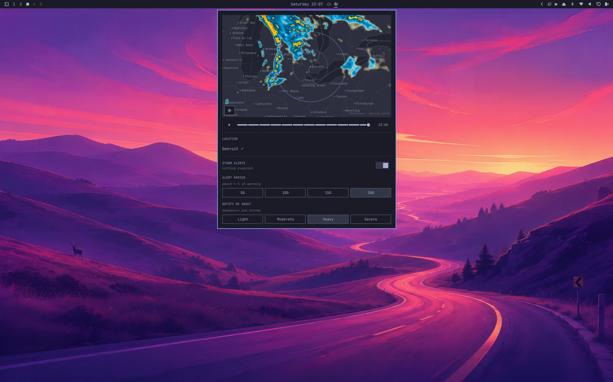
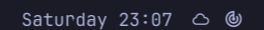
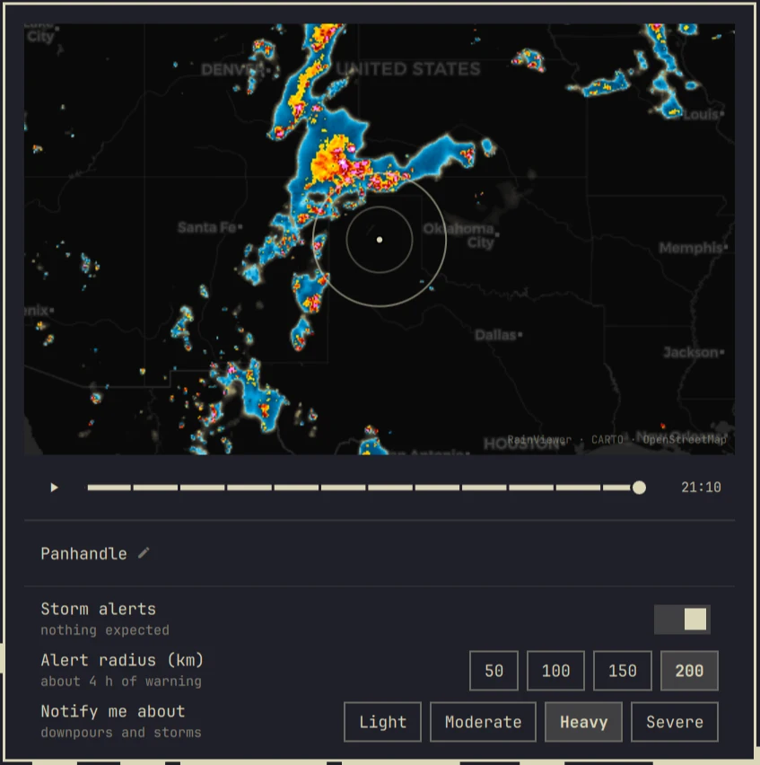
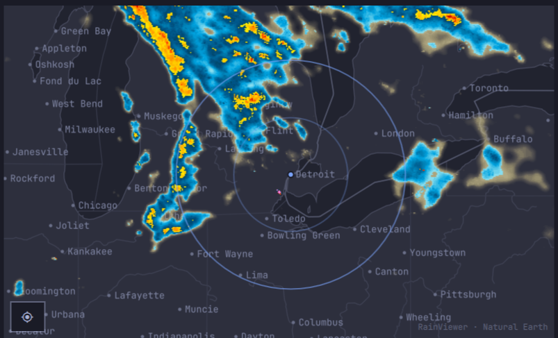
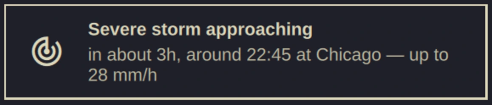

# Weather Radar for Omarchy

Live weather radar for the [Omarchy](https://omarchy.org) bar. Click the bar
icon for a map centred on your location, scrub through the last two hours of
precipitation, and optionally be told when a storm is on its way.

Works anywhere RainViewer has radar coverage, which is most of the populated
world — no account and no API key.



> **Not a life-safety tool.** This plugin is informational. It shows
> best-effort third-party radar with no availability guarantee, and it can be
> late, wrong, or silent. For decisions that matter, use your national weather
> service and civil defence warnings.

## Install

```bash
omarchy plugin add https://github.com/eduardodallecort/omarchy-weather-radar.git --enable
```

The widget lands on the right of the bar. Consider moving it beside the stock
weather widget, which sits in the centre by default:

```bash
omarchy plugin enable eduardodallecort.weather-radar --section center --after omarchy.weather
```



The icon is a radar scope, which on its own says "radar" rather than "weather";
standing next to a weather widget supplies the rest. `--section` takes `left`,
`center` or `right`, and `--before` works like `--after`. Re-running `enable`
rewrites the widget's entry, so move it before tuning the settings rather than
after.

### Removing it

```bash
omarchy plugin remove eduardodallecort.weather-radar
```

That deletes the plugin and its entry in the bar. It leaves
`~/.local/state/omarchy/settings/weather.json` alone, since that file belongs to
the stock weather widget rather than to this plugin.

### Requirements

Omarchy Quattro, and `curl`, which Omarchy already installs. The plugin calls
`omarchy-weather-location` to store a chosen city and `omarchy-notification-send`
to raise an alert — both ship with Omarchy. Nothing else is installed, and no
configuration outside the widget's own entry is written.

## The map



| | |
| --- | --- |
| Drag | pan |
| Wheel, `+` / `-` | zoom |
| Play button, `Enter` | play the last two hours |
| `←` / `→` | step one frame |
| `Home` | recentre on your location |
| `Esc` | close |

### What the colours mean



Radar shows **precipitation**, not cloud. A completely overcast sky with no rain
falling reads as an empty map — that is correct, not a fault. Warmer colours
mean heavier precipitation, and the most intense cores usually indicate hail.

Eight palettes are available in the widget settings. NEXRAD Level III is the one
most broadcast meteorologists use.

### Zoom

RainViewer's radar tiles stop at zoom level 7, about 1.1 km per pixel. The map
goes to level 10 anyway: past level 7 the base map carries on sharpening while
the radar is scaled up over it.

You zoom in to find out *which town* is under a storm, and the town comes from
the base map, so capping the map at the radar's resolution would withhold detail
that is genuinely available. The radar simply gets blockier, which shows plainly
where its data ran out.

### Where there is no radar

Large parts of the world have no ground radar at all, and there an empty map
means "nothing is known" rather than "nothing is falling". When your location is
outside coverage, the panel says so beside the city name.

## Location

Click the city name at the bottom of the panel and type to search.

The picker is the stock weather widget's — same geocoding, same suggestions —
and it writes to the same file, so a city chosen here moves the stock weather
widget too, and one chosen there moves the radar. Both watch the file, so
neither needs a restart.

The location lives in `~/.local/state/omarchy/settings/weather.json`, owned by
`omarchy-weather-location`, which can also be called directly:

```bash
omarchy-weather-location
```

Clearing it returns the weather widget to IP auto-detection. The radar needs
coordinates to centre on, so it shows a world view until a city with
coordinates is chosen.

In a large city, name your neighbourhood rather than the city: São Paulo is some
50 km across and its centre says nothing useful about the far side. The picker
resolves Tatuapé, Vila Mariana, Itaquera and the rest, and the region shown
beside each suggestion separates them from their namesakes elsewhere.

## Alerts

Alerts are **off by default**. Turn them on from the toggle in the panel, or in
the widget settings.

While on, the plugin checks the forecast every ten minutes — the rate the radar
publishes new frames, so checking more often would re-fetch bytes that have not
changed. That is roughly 11 MB a month. With alerts off it makes no background
requests at all, and fetches only while the map is open.

Two settings shape what reaches you, and they answer different questions. The
**radius** decides how far ahead to look; the **threshold** decides how bad it
has to be to be worth interrupting you. Both are in the panel once alerts are
on, and in the widget settings either way.

### The threshold: how bad is worth saying

| Threshold | Rain rate | In practice |
| --- | --- | --- |
| Light | 0.5 mm/h | drizzle |
| Moderate | 2.5 mm/h | steady rain |
| Heavy | 7.6 mm/h | downpours and convective cores — the default |
| Severe | 15 mm/h | a deluge, or promoted from Heavy by the rule below |

Rates follow the standard intensity scale, checked against 2144 forecast samples
over the Sahel, the Amazon, the United States, Indonesia and India. Heavy lands
near the 99th percentile of wet slots in that survey: rare enough to mean
something, common enough to fire.

The promotion rule is the one that matters for storms. An already-rainy slot is
raised one band when CAPE reaches 2000 J/kg, or 1000 J/kg alongside gusts of
45 km/h. Rain alone does not make weather severe — rain arriving into an
unstable airmass does, and CAPE measures the energy available to it.

A severe alert names the figures that put it there, and only those: rain heavy
enough on its own reads "up to 18 mm/h", while ordinary rain into a loaded
airmass reads "CAPE 2400 J/kg". Printing every figure regardless would produce
sentences that argue with themselves, since a mild gust quoted beside the word
severe reads as a contradiction.

A threshold is what keeps the plugin usable. Without one, a two-hour window
fires on every passing shower, which in a wet season is constant noise — and a
plugin switched off in irritation takes the alert that mattered with it.

### The radius: how much warning you want

| Radius | Warning | Trade-off |
| --- | --- | --- |
| 50 km | ~1 h | late, but almost never wrong |
| 100 km | ~2 h | the default |
| 150 km | ~3 h | enough time to act on |
| 200 km | ~4 h | more warning, more false alarms |

The radius draws the rings on the map and sets how far ahead the forecast is
inspected, converted at an assumed 50 km/h. Lead time is not free: a four-hour
forecast is meaningfully less certain than a one-hour one, so a wider radius
buys warning at the cost of crying wolf more often.

The panel offers those four. The widget settings take any value from 25 to
250 km in steps of 25, and one set there appears in the panel alongside the
presets.

### Where it looks

The forecast model runs on a grid roughly 8-10 km across, and a single
coordinate speaks for whichever cell it lands in rather than for the place it
names. Measured against Marmeleiro in Paraná: the town centre resolves to a cell
3.8 km away, and a point 1 km south belongs to the next cell over.

So each check samples five points — the centre and four at 5 km — and reports
the worst. Around Marmeleiro that covers three model cells instead of one. All
five travel in a single request, so the coverage costs a larger response rather
than more requests.

Five kilometres covers a town without becoming a regional forecast. Below about
8 km the model has no detail to give: rain on one side of a small town and not
the other is a distinction it does not carry. The map is the finer instrument,
at 1.1 km per pixel.

### Being told once

You are not told twice about the same thing. An alert speaks again only if
conditions get *worse* — heavy becoming severe — and re-arms itself when the
outlook drops back under your threshold. A storm parked overhead for three hours
is one notification, not eighteen.

Deliberate acts re-arm it, on the principle that adjusting a control is a
question and deserves an answer rather than ten minutes of silence:

| | |
| --- | --- |
| Middle-click the bar icon | checks now, quietly — you are not re-notified |
| Toggle alerts off and on | re-arms — you are told the current state |
| Change the threshold | re-evaluates the reading already in hand |
| Change the radius | fetches again, since the lead window moved |
| Change the city | a new place has not been reported on yet |

Switching the toggle off and on is therefore the closest thing to "tell me
again".

### On screen




| Level | Stays | |
| --- | --- | --- |
| Severe, Heavy | until dismissed | the value of an alert lies in the moment you were not looking |
| Moderate, Light | 8 seconds | worth saying, not worth camping on the screen |

A timed toast that fires while you are in the next room is a toast that never
happened, and that is the case an alert exists for. Heavy is also the default
threshold — the level this plugin calls worth interrupting you over — so letting
it expire unseen would contradict its own choice.

That does not make them emergencies: Omarchy only lets a popup through Do Not
Disturb when the sender is CLI-style, and this one names itself, so a silenced
session files them into notification history instead of showing them.

Clicking an alert dismisses it and nothing else. A click on a toast means "I
have seen this" to almost everyone, and spending that gesture on opening a
window answers a question the reader did not ask. Open the map yourself when you
want it.

Every alert carries both a relative and an absolute time — "in about 2h, around
21:15" — because the relative half is what the eye wants on arrival and the
absolute half is what stays true for someone reading it later.

## Data sources

- Radar imagery: [RainViewer](https://www.rainviewer.com) — best-effort, no SLA
- Forecast and geocoding: [Open-Meteo](https://open-meteo.com)
- Base map: [CARTO](https://carto.com/basemaps/) over
  [OpenStreetMap](https://www.openstreetmap.org/copyright) data

## Roadmap

- Satellite cloud layer (GOES / Himawari via NASA GIBS)
- Additional radar providers for regions with higher-resolution national
  networks, selectable per user
- Motion-based arrival estimate rather than distance alone

## Development

Symlink a checkout into the plugin directory and the shell picks it up, so the
source can live wherever you keep your projects:

```bash
ln -s ~/path/to/omarchy-weather-radar ~/.config/omarchy/plugins/eduardodallecort.weather-radar
omarchy-shell shell rescanPlugins
omarchy plugin enable eduardodallecort.weather-radar
omarchy plugin validate .
```

**After editing any QML, restart the shell:**

```bash
omarchy restart shell
```

Quickshell's hot reload is deliberately off in Omarchy. A watcher sometimes logs
`Local plugin changed, reloading`, but it cannot be relied on: writing a file
atomically — a temporary plus a rename, which most editors and tools do — breaks
the inotify watch on the original inode, so it fires once and then goes quiet.
`rescanPlugins` re-reads manifests without recompiling QML that is already
loaded. Restarting is the only reliable way to see a change, and an edit that
appears to do nothing is usually an edit that was never loaded.

### Layout

| File | |
| --- | --- |
| `Service.qml` | headless singleton: frame manifest, forecast polling, alert decisions |
| `Panel.qml` | the map, timeline, city picker and alert controls |
| `BarWidget.qml` | the bar pill |
| `TileLayer.qml` | one raster layer of an XYZ tile map |
| `TileMath.js` | Web Mercator projection, distance and bearing |
| `RadarModel.js` | RainViewer endpoints, parsing, thresholds, sampling |

A bar widget is instantiated once per monitor, so anything that polls belongs in
the service, which the shell mounts exactly once per plugin.

## Licence

MIT. See [LICENSE](LICENSE).
