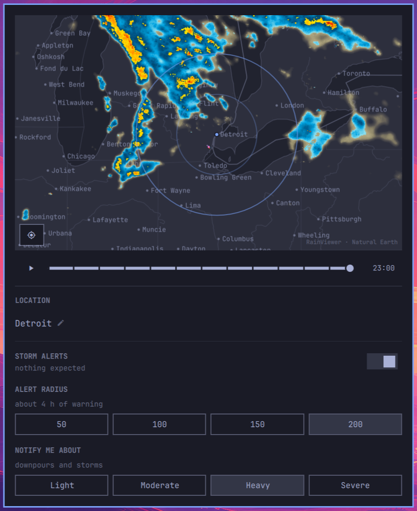

# Weather Radar for Omarchy

Live weather radar for the [Omarchy](https://omarchy.org) bar. Click the bar
icon for a map centred on your location, scrub through the last two hours of
precipitation, and optionally be told when a storm is on its way.

Works anywhere RainViewer has radar coverage, which is most of the populated
world — no account and no API key.


> **Not a life-safety tool.** This plugin is informational. It shows
> best-effort third-party radar with no availability guarantee, and it can be
> late, wrong, or silent. For decisions that matter, use your national weather
> service and civil defence warnings.

## Install

```bash
omarchy plugin add https://github.com/eduardodallecort/omarchy-weather-radar.git --enable
```

The widget lands on the right of the bar. Consider moving it beside the stock
weather widget, which sits in the centre by default:

```bash
omarchy plugin enable eduardodallecort.weather-radar --section center --after omarchy.weather
```


The icon is a radar scope, which on its own says "radar" rather than "weather";
standing next to a weather widget supplies the rest. `--section` takes `left`,
`center` or `right`, and `--before` works like `--after`. Re-running `enable`
rewrites the widget's entry, so move it before tuning the settings rather than
after.

If that second command reports the plugin is unknown, run it again. Installing
asks the shell to rescan and returns before the shell has finished indexing the
new directory, so a command issued immediately afterwards can arrive first.

### Updating

```bash
omarchy plugin update eduardodallecort.weather-radar
omarchy restart shell
```

The restart is not optional. `omarchy plugin update` fetches the new code and
asks the shell to rescan, but an already-mounted service is not rebuilt from
it — the shell logs that it reloaded the plugin while continuing to run the
version it started with. Until the shell restarts, an update has changed the
files on disk and nothing else.

### Removing it

```bash
omarchy plugin remove eduardodallecort.weather-radar
```

That deletes the plugin and its entry in the bar. It leaves
`~/.local/state/omarchy/settings/weather.json` alone, since that file belongs to
the stock weather widget rather than to this plugin.

Two files of the plugin's own stay behind as well, and both are safe to delete:
the radar tiles it keeps (see [What it keeps on disk](#what-it-keeps-on-disk)),
and the record of the last storm alert (see [Being told once](#being-told-once)).

```bash
rm -rf "${XDG_CACHE_HOME:-$HOME/.cache}/omarchy/plugins/eduardodallecort.weather-radar"
rm -f ~/.local/state/omarchy/weather-radar-alert.json
```

### Requirements

Omarchy Quattro, and `curl`, which Omarchy already installs. The base map needs
nothing at all — it ships with the plugin. The plugin calls
`omarchy-weather-location` to store a chosen city and `omarchy-notification-send`
to raise an alert — both ship with Omarchy. Nothing else is installed, and no
configuration outside the widget's own entry is written. Besides that entry it
writes only the radar tile cache and the alert record named above.

## The map



| | |
| --- | --- |
| Drag | pan |
| Wheel, `+` / `-` | zoom towards the pointer |
| Play button, `Enter` | play the last two hours |
| `←` / `→` | step one frame |
| Crosshair button, `Home` | recentre on your location |
| `Esc` | close |

The panel opens on your location and on the newest frame, every time. Both are
questions about now: panning and scrubbing are for looking around while you are
there, not for choosing what the panel shows the next time you ask.

While it is open the opposite holds. A new frame list arriving every ten minutes
does not move you: if you have scrubbed back to a particular time, you stay on
that time, at whatever position it has moved to since — or on the oldest frame
still published, once the moment has aged out of the two-hour window.

While it is open the map looks for the next frame a minute after it is due,
ten minutes after the newest one it has, and then every minute until it is
published — so a new frame is on screen a minute or two after RainViewer lists
it. Once you close it, the map asks for nothing more: a batch of tiles already
under way finishes, and that is all.

### What it keeps on disk

Each radar tile is fetched once and kept in
`~/.cache/omarchy/plugins/eduardodallecort.weather-radar/tiles/` (or under
`$XDG_CACHE_HOME`) for as long as its frame is in the two-hour loop. Playing the
loop reads them back from there, so going round it again costs RainViewer
nothing and a new frame every ten minutes costs one frame's tiles, however long
a storm is watched.

When the map opens, and whenever the view stops moving, the frame shown and
the one after it are fetched straight away, which is all a paused map needs.
While the loop plays, the rest of it follows once the view has stayed put for
a second, so dragging across a region does not fetch thirteen frames at every
stop on the way. A playing loop does not run ahead of its tiles: it waits on
the frame it is showing until the next one has arrived, for up to seven
seconds, and does not wait for a tile that has failed twice or that RainViewer
refused. A frame arriving any other way, a new one published or a step by
hand, fades in once its tiles are there, within the same seven seconds.

A loop is a few megabytes. Tiles are deleted as their frame leaves the loop,
which the map checks each time it receives a new frame list while open, and
the directory is emptied the first time the map opens after the shell starts,
or after it reloads its plugins, which it does whenever anything is written in
a plugin's directory, an install or an update included. It never holds more
than 2,000 tiles: past that it is emptied and refilled with what is on screen.
The tiles are decoded from disk as the loop plays
rather than held in memory, which would cost about 65 MB inside the process
that draws the bar. If the cache cannot be written, a full disk or a directory
that cannot be made, the map says so in the journal and loads tiles straight
from the network for the rest of the session.

The only other file the plugin writes is small: the record of the last storm
alert, in `~/.local/state/omarchy/weather-radar-alert.json`, described under
[Being told once](#being-told-once).

### What the colours mean


Radar shows **precipitation**, not cloud. A completely overcast sky with no rain
falling reads as an empty map — that is correct, not a fault. Warmer colours
mean heavier precipitation, and the most intense cores usually indicate hail.

### The base map

The coastlines, borders, lakes, rivers, city footprints and place names are
**drawn by the plugin from data in the repository**, not fetched from a tile
server. That has three consequences worth knowing about:

- The map works with **no network at all**. Only the radar needs one.
- Nothing about it can be withdrawn or rate-limited. Earlier versions used a
  free tile service that began requiring an API key in August 2026 and stamped
  a watermark across every tile until one was supplied.
- It follows your Omarchy theme. Switch themes and the ground changes with
  everything else, while the radar keeps its own palette — see
  [What the colours mean](#what-the-colours-mean).

The trade is detail. The data is Natural Earth at 1:10 million, so there are no
streets and no municipal boundaries, and at the deepest zoom a coastline is
visibly generalised. City names are Natural Earth's own, which are usually the
local spelling — `København`, `Göteborg` — and occasionally the English one:
`Cologne` rather than `Köln`.

### Zoom

RainViewer's radar tiles stop at zoom level 7, about 1.1 km per pixel. The map
goes to level 9 anyway: past level 7 the ground carries on sharpening while the
radar is scaled up over it, which shows plainly where the radar's data ran out.

It stops at 9 because that is where the ground runs out too. Natural Earth at
1:10 million is drawn for scales down to roughly 1:2 million; magnifying it
further would show a precision it does not have, over radar that was already
being upscaled two levels earlier.

### Where there is no radar

Large parts of the world have no ground radar at all, and there an empty map
means "nothing is known" rather than "nothing is falling". When your location is
outside coverage, the panel says so beside the city name.

### When the map has nothing to draw

An empty radar reads as "it is not raining", so the map says which of the two it
is: `Loading radar…` while the frames are on their way, and `Radar unavailable`
when fetching them failed and there are none.

With frames already in hand it keeps drawing them, with no network at all — the
tiles are on disk, so the last two hours stay on screen and the timeline
underneath says which moment each one is. While the panel is open, a frame
list that failed is asked for again every minute, and opening the panel asks
for anything missing, so reconnecting clears it without a restart.

While the frame on screen is still waiting for some of its tiles, after a pan
or a zoom, the map says `Loading radar…` once the wait has lasted a moment,
since an empty stretch of map would otherwise read as clear sky.

When the frame on screen needs tiles that are not on disk and cannot be
fetched, the map says so instead of showing an empty sky:
`Radar paused: RainViewer is limiting requests` as soon as RainViewer answers
with its rate limit, and `Couldn't load the radar` for anything else — no
network, a timeout, a server error — once a tile has failed twice. A single
failure is ordinary: a new frame's tiles often arrive a little after the frame
is announced, so the first retry comes five seconds later, and the later ones
after a growing delay: never more than half a minute when nothing answered at
all, so the map notices the network coming back by itself. The panel opening
again retries them at once, and so does any tile arriving, for tiles that
failed while nothing arrived at all. A tile that fails while the tiles beside
it arrive keeps its own delay. A rate limit is always waited out first. Every failure is logged, with the status RainViewer answered, and
both messages clear on their own once the tiles arrive. Tiles
already on disk never raise either message, so a loop fetched earlier plays
offline without a warning over it.

## Location

Click the city name at the bottom of the panel and type to search.

The picker is the stock weather widget's — same geocoding, same suggestions —
and it writes to the same file, so a city chosen here moves the stock weather
widget too, and one chosen there moves the radar. Both watch the file, so
neither needs a restart.

The location lives in `~/.local/state/omarchy/settings/weather.json`, owned by
`omarchy-weather-location`, which can also be called directly:

```bash
omarchy-weather-location
```

Clearing it returns the weather widget to IP auto-detection.

Pressing Enter on text that matched nothing saves it as a name, which is what
the stock weather widget wants — it resolves names itself. The radar cannot: it
centres on a coordinate and fetches the forecast by coordinate. So a location
saved that way is reported as having no coordinates, beside the city name and
under the STORM ALERTS heading, rather than leaving the map quietly empty.

In a large city, name your neighbourhood rather than the city: São Paulo is some
50 km across and its centre says nothing useful about the far side. The picker
resolves Tatuapé, Vila Mariana, Itaquera and the rest, and the region shown
beside each suggestion separates them from their namesakes elsewhere.

## Alerts

Alerts are **off by default**. Turn them on from the toggle in the panel.

While on, the plugin checks the forecast every ten minutes — the forecast model
does not update any faster, so checking more often would re-fetch bytes that
have not changed. That is roughly 15 MB a month. When checks keep failing and
the panel is closed, it waits longer between them, up to an hour; opening the
panel asks again at once. With alerts off it makes no background requests at
all, and fetches only while the map is open.

Two settings shape what reaches you, and they answer different questions. The
**radius** decides how far ahead to look; the **threshold** decides how bad it
has to be to be worth interrupting you. Both are in the panel once alerts are
on.

### The threshold: how bad is worth saying

| Threshold | Rain rate | In practice |
| --- | --- | --- |
| Light | 0.3 mm/h | any rain the forecast reports |
| Moderate | 2.5 mm/h | steady rain |
| Heavy | 7.6 mm/h | downpours and convective cores — the default |
| Severe | 15 mm/h | a deluge, or promoted from Heavy by the rule below |

Moderate, Heavy and Severe follow the standard intensity scale, checked against
2144 forecast samples over the Sahel, the Amazon, the United States, Indonesia
and India. Heavy lands near the 99th percentile of wet slots in that survey:
rare enough to mean something, common enough to fire.

Light sits below the scale's drizzle boundary of 0.5 mm/h on purpose. The
forecast reports rain rounded to a tenth of a millimetre per quarter hour, so
0.4 mm/h is the smallest amount it can express and nothing lands between that
and nothing at all — in a sample of 1728 slots, 59% of the wet ones were exactly
that one step. A band at 0.5 mm/h could not be reached from below, so Light
means "the forecast reports rain".

The promotion rule is the one that matters for storms. A slot already at
moderate or above is raised one band when CAPE reaches 2000 J/kg, or 1000 J/kg
alongside gusts of 45 km/h. Rain alone does not make weather severe — rain
arriving into an unstable airmass does, and CAPE measures the energy available
to it.

Each slot is judged against the hour it falls in, peaked across the five
sampled points. Across points because an airmass does not stop at the edge of a
grid cell; within the hour because the atmosphere at five in the afternoon is
not the atmosphere now, and pairing the two would report rain falling into
still air as a storm on the strength of a squall forecast for later.

A severe alert names the figures that put it there, and only those: rain heavy
enough on its own reads "up to 18 mm/h", while ordinary rain into a loaded
airmass reads "CAPE 2400 J/kg". Printing every figure regardless would produce
sentences that argue with themselves, since a mild gust quoted beside the word
severe reads as a contradiction.

A threshold is what keeps the plugin usable. Without one, a two-hour window
fires on every passing shower, which in a wet season is constant noise — and a
plugin switched off in irritation takes the alert that mattered with it.

### The radius: how much warning you want

| Radius | Warning | Trade-off |
| --- | --- | --- |
| 50 km | ~1 h | late, but almost never wrong |
| 100 km | ~2 h | the default |
| 150 km | ~3 h | enough time to act on |
| 200 km | ~4 h | more warning, more false alarms |

The radius draws the rings on the map and sets how far ahead the forecast is
inspected, converted at an assumed 50 km/h. Lead time is not free: a four-hour
forecast is meaningfully less certain than a one-hour one, so a wider radius
buys warning at the cost of crying wolf more often.

The panel offers those four. Any other multiple of 25 between 25 and 250 km
works too, set as `alertRadiusKm` on the widget's entry in
`~/.config/omarchy/shell.json`; a value put there appears in the panel alongside
the presets.

### Where it looks

The forecast model runs on a grid roughly 8-10 km across, and a single
coordinate speaks for whichever cell it lands in rather than for the place it
names. Measured against a small town: its centre resolves to a cell 3.8 km away,
and a point 1 km south belongs to the next cell over.

So each check samples five points — the centre and four at 5 km — and reports
the worst. Around that town it covers three model cells instead of one. All
five travel in a single request, so the coverage costs a larger response rather
than more requests.

Five kilometres covers a town without becoming a regional forecast. Below about
8 km the model has no detail to give: rain on one side of a small town and not
the other is a distinction it does not carry. The map is the finer instrument,
at 1.1 km per pixel.

### Being told once

You are not told twice about the same thing. An alert speaks again only if
conditions get *worse* — heavy becoming severe — and re-arms itself when the
outlook drops back under your threshold. A storm parked overhead for three hours
is one notification, not eighteen.

Deliberate acts re-arm it, on the principle that adjusting a control is a
question and deserves an answer rather than ten minutes of silence:

| | |
| --- | --- |
| Open the panel | asks again if the last attempt failed, or if the reading is older than the cycle |
| Middle-click the bar icon | checks now, quietly — you are not re-notified |
| Toggle alerts off and on | re-arms — you are told the current state |
| Change the threshold | re-evaluates the reading already in hand |
| Change the radius | fetches again, since the lead window moved |
| Change the city | a new place has not been reported on yet |

Those are two different questions. Opening the panel refreshes a reading that
has gone stale or was failing; it does not tell you again about weather you have
already been told about. Switching the toggle off and on is what does that.

What you were last told is kept in
`~/.local/state/omarchy/weather-radar-alert.json`: the level, the place and the
time. It is written to disk because the shell rebuilds every plugin service
whenever any plugin writes inside its own directory. A record held only in
memory would be emptied by that, and a storm already announced would be
announced again seconds later. Records older than three hours are ignored, so
later weather still gets through.

Where the file cannot be written, a read-only state directory or a full disk,
alerts still arrive. The record is then kept in memory for as long as the
plugin runs, and the journal says so once. A session with no home directory has
no location to watch, so it sends no alerts, but the plugin still loads and
writes nothing anywhere.

### What the switch says

The line under the STORM ALERTS heading reports what the watch is actually doing,
because a quiet plugin and a broken one look the same otherwise:

| | |
| --- | --- |
| `off` | the switch is off |
| `no location set` | nothing is stored to check |
| `the saved location has no coordinates` | a name is stored, but nothing to centre or forecast on |
| `starting…` | nothing has come back yet |
| `checking…` | a request is in flight |
| `cannot reach the forecast` | one came back and failed — this is not silence, it is an outage |
| `no forecast for this location` | it answered with nothing usable for these coordinates |
| `nothing expected` | it answered, and there is no weather to report |
| `heavy expected around 21:45` | the outlook, and when |
| `… · not updating` | the reading still stands, but the checks behind it are failing |

A reading already in hand is kept and marked rather than replaced by the error.
Losing it would trade something true and slightly old for nothing at all, and
the reading is what you opened the panel to see.

Opening the panel asks again if the last attempt failed, or if the reading is
older than the quarter hour the forecast is published on — so reconnecting and
reopening is enough, and there is no need to toggle the switch off and on.
Inside that window it asks for nothing, since the answer would be the bytes it
already holds.

### On screen


| Level | Stays | |
| --- | --- | --- |
| Severe, Heavy | until dismissed | the value of an alert lies in the moment you were not looking |
| Moderate, Light | 8 seconds | worth saying, not worth camping on the screen |

A timed toast that fires while you are in the next room is a toast that never
happened, and that is the case an alert exists for. Heavy is also the default
threshold — the level this plugin calls worth interrupting you over — so letting
it expire unseen would contradict its own choice.

That does not make them emergencies: Omarchy only lets a popup through Do Not
Disturb when the sender is CLI-style, and this one names itself, so a silenced
session files them into notification history instead of showing them.

Clicking an alert dismisses it and nothing else. A click on a toast means "I
have seen this" to almost everyone, and spending that gesture on opening a
window answers a question the reader did not ask. Open the map yourself when you
want it.

Every alert carries both a relative and an absolute time — "in about 2h, around
21:15" — because the relative half is what the eye wants on arrival and the
absolute half is what stays true for someone reading it later.

## Data sources

- Radar imagery: [RainViewer](https://www.rainviewer.com) — best-effort, no SLA
- Forecast and geocoding: [Open-Meteo](https://open-meteo.com)
- Base map: [Natural Earth](https://www.naturalearthdata.com/) 1:10m and 1:50m,
  public domain, shipped with the plugin as `data/basemap.bin`

## Roadmap

- Satellite cloud layer (GOES / Himawari via NASA GIBS)
- A denser place-name set for the deepest zoom levels
- Additional radar providers for regions with higher-resolution national
  networks, selectable per user
- Motion-based arrival estimate rather than distance alone

## Development

Symlink a checkout into the plugin directory and the shell picks it up, so the
source can live wherever you keep your projects:

```bash
ln -s ~/path/to/omarchy-weather-radar ~/.config/omarchy/plugins/eduardodallecort.weather-radar
omarchy-shell shell rescanPlugins
omarchy plugin enable eduardodallecort.weather-radar
omarchy plugin validate .
```

**After editing any QML, restart the shell:**

```bash
omarchy restart shell
```

Quickshell's hot reload is deliberately off in Omarchy. A watcher sometimes logs
`Local plugin changed, reloading`, but it cannot be relied on: writing a file
atomically — a temporary plus a rename, which most editors and tools do — breaks
the inotify watch on the original inode, so it fires once and then goes quiet.
`rescanPlugins` re-reads manifests without recompiling QML that is already
loaded. Restarting is the only reliable way to see a change, and an edit that
appears to do nothing is usually an edit that was never loaded.

### Layout

Everything that is a plain function lives in `lib/`, where Node tests it.
Everything that needs Qt lives in a `.qml` file, and is tested by running it
wherever that can be done outside the shell (see [Tests](#tests)).

| File | |
| --- | --- |
| `Service.qml` | headless singleton: frame manifest, radar tile cache, forecast polling, alert decisions |
| `Panel.qml` | panel state and lifecycle; composes the pieces below |
| `BarWidget.qml` | the bar pill |
| `ui/RadarMap.qml` | basemap, radar layers, alert rings, pan and zoom |
| `ui/BasemapLayer.qml` | draws the ground, in the running theme's colours |
| `ui/TileLayer.qml` | one raster layer of an XYZ tile map |
| `ui/CoverageProbe.qml` | reads the coverage mask to answer "is there radar here" |
| `ui/Timeline.qml` | play/pause and the frame scrubber |
| `ui/LocationPicker.qml` | the city row and its search results |
| `ui/AlertControls.qml` | the alert switch, radius and threshold |
| `ui/ChoiceSection.qml` | a heading, what it costs, and a row of equal buttons |
| `lib/TileMath.js` | Web Mercator projection, distance and bearing |
| `lib/RadarModel.js` | RainViewer endpoints, parsing, echo analysis, sampling |
| `lib/TileCache.js` | where each radar tile is kept on disk, and the commands that fetch and delete them |
| `lib/Alerts.js` | intensity bands, forecast reduction, the latch, and what the panel says |
| `lib/Settings.js` | reading and coercing the widget's settings |
| `lib/Basemap.js` | decodes `data/basemap.bin` and projects it into the viewport |
| `lib/Frames.js` | which radar frame to show, across a list that keeps being replaced |
| `lib/Glyphs.js` | every Nerd Font glyph the plugin draws |
| `tools/build-basemap.py` | builds `data/basemap.bin` from Natural Earth |

A bar widget is instantiated once per monitor, so anything that polls belongs in
the service, which the shell mounts exactly once per plugin.

### Rebuilding the base map

`data/basemap.bin` is generated and committed. Rebuild it only when the layers
or their simplification change:

```bash
python3 tools/build-basemap.py
```

It downloads Natural Earth into `tools/.cache` (about 70 MB, ignored by git),
simplifies each layer, quantises the coordinates onto a grid of a thousandth of
a degree, and writes roughly 2.6 MB. The format is documented at the top of the
generator and decoded by `lib/Basemap.js`; both sides are pinned by tests, so a
change to one without the other fails rather than shipping a map of noise.

### Tests

The files in `lib/` are QML `.pragma library` files, which are plain JavaScript
once the QML-only directives are stripped. `test/load.js` does the stripping and
runs the real file, so the tests exercise what the shell loads rather than a
copy of it. No dependencies, and Node's own runner:

```bash
node --test
```

They cover the projection, the RainViewer and Open-Meteo parsing, the alert
bands and latch, the settings coercion, the frame selection, when the frame
list is next asked for, the tile cache's names, commands, retry delays and
notices, and the glyph codepoints. Some of them pin bugs that have already been
fixed once.

`test/streams.test.js` is a different kind of check: it holds the QML sources to
a written-down inventory of everything that reaches the shell process, and to a
ceiling on each. A plugin runs inside the process that owns the bar, the panels
and the lock screen, so a stream added later without a limit fails the suite
rather than turning up in a review.

`test/qml-source.test.js` is the same kind of check aimed at the QML: that every
`Text` declares `Text.PlainText`, and that the place name reaching the
notification body is made inert first. Both are claims about source, which is
why `test/text-format.sh` below renders them and measures what Qt actually does.

The rest run the QML itself, under Quickshell or Qt rather than in Node,
offline, with the commands the plugin calls replaced on PATH. What they share —
how a missing runtime skips, how a check is reported, a fake RainViewer that can
be switched between working, slow, no network, hanging and a full disk, or made
to refuse chosen tiles with a 429 or a timeout — is
`test/harness.sh`, with `test/probe/Kit.qml` for the probes. Each skips where
its runtime is missing (`qs`, or `qml6`), and `RADAR_REQUIRE_QS=1` turns that
skip into a failure, which is what CI sets:

```bash
./test/first-run.sh      # a machine that has never set a weather location
./test/stale-forecast.sh # a forecast answers the question that was asked
./test/basemap-steps.sh  # decoding the ground never stalls the shell
./test/tile-count.sh     # a radar layer counts the tiles it is still loading
./test/tile-cache.sh     # each radar tile is fetched once, however long the loop plays
./test/tile-failures.sh  # a 429, a timeout and a repeated failure, and what the map says
./test/tile-limits.sh    # a deleted or unreadable tile, and the ceiling on tiles
./test/tile-recovery.sh  # the radar recovers on its own from hangs, sleep and outages
./test/restricted-env.sh # a read-only state directory, and no HOME at all
./test/text-format.sh    # a place name cannot make the shell fetch a URL
```

The first loads the real `Service.qml` against a home directory that does not
exist. It exists for a gap the code can only assert in a comment: the
location file is watched, but a watch reaches no further than the directory
holding it, and on a fresh machine that directory has never been created — so
the first location ever written is invisible to the watch meant to notice it.
What closes the gap is the panel calling `reloadLocation()` after a save, and
nothing but this notices if that call is removed.

`test/basemap-steps.sh` watches the thread that draws the shell while the
real service decodes the ground, and fails on a stall: the decode runs in steps
of a few milliseconds, one per frame, and this is what keeps it that way.

`tile-cache.sh`, `tile-failures.sh`, `tile-limits.sh` and `tile-recovery.sh` run
the real service against the fake RainViewer, which logs every URL.
`tile-cache.sh` fetches a whole loop, asks for it again, and fails unless every
tile was requested exactly once; it also checks that an
earlier session's cache is cleared first, that two maps both get their loop,
that a frame leaving the loop takes its tiles with it, and when the frame list
is next looked at. `tile-failures.sh` makes the newest frame fail with 429s and
timeouts, and checks what is waited for, what is retried and when, and what
the map says. `tile-limits.sh` covers a file deleted from under the map, a
tile that keeps arriving unreadable, and the ceiling on tiles.
`tile-recovery.sh` switches the fake between working, slow, no network, hanging
and a full disk, and checks that nothing can leave the radar stuck until the
shell restarts.

`test/restricted-env.sh` runs the service on machines unlike this one. Where
the state directory cannot be written, the storm alert must still be sent, and
the record that cannot be kept stays in memory with one line in the journal
saying so. With no home at all, the service must still load without a tile
cache, and nothing may be written anywhere.

`test/tile-count.sh` drives the real `ui/TileLayer.qml` through new frames,
pans and missing tiles. The loop holds each crossfade until the incoming layer
has its tiles, and the layer knows that only by counting them. A count that
runs low reads as ready while tiles are still loading, and the fade starts
against an empty layer with nothing visibly wrong. This checks at every step
that the count equals the tiles actually loading.

`test/text-format.sh` renders hostile strings under Qt and watches a socket.
QML's `Text` defaults to `Text.AutoText`, which decides per string whether it is
markup, so a
place name shaped like an `` tag is fetched over the network by the process
that owns the bar, the panels and the lock screen. Every `Text` here declares
`Text.PlainText`; the notification body cannot, because Omarchy's own card
renders it as `Text.StyledText`, so the name goes through `Alerts.inertText`
first.

Only `Service.qml` and `ui/TileLayer.qml` can run on a runner. `Panel.qml`,
`BarWidget.qml` and most of `ui/` import `qs.Commons` and `qs.Ui`, which exist
only inside the shell.

QML is also checked statically, which needs the shell's modules on the import
path:

```bash
qmllint -I /usr/share/omarchy/shell -I . *.qml ui/*.qml
```

`Panel.qml` fails this on the typed function signatures inside its `IpcHandler`,
which Quickshell requires and this `qmllint` cannot parse. It fails without a
message, so check the exit status: 255 for `Panel.qml`, 0 for every other file.

## Licence

MIT. See [LICENSE](LICENSE).
